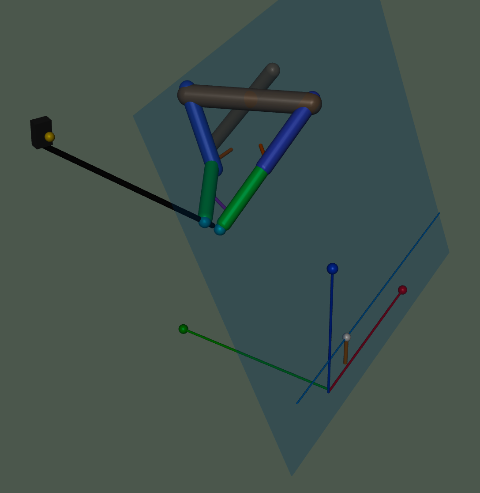

# MuJoCo Golf Swing AI

## Project Demos

<table>
  <tr>
    <td align="center"><strong>Simulated golf swing</strong></td>
    <td align="center"><strong>Code and model walkthrough</strong></td>
  </tr>
  <tr>
    <td></td>
    <td></td>
  </tr>
</table>



This project explores reinforcement learning under data scarcity. Detailed golf
swing datasets are difficult to access, so I use simulation to create training
environments where AI models can learn, test, and improve swing decisions with
limited real-world data. The same challenge appears in financial modeling,
sports business, and policy-making, where data is often private, incomplete, or
noisy, but decision-makers still need models that can reason through uncertainty
and search for better outcomes.

This project is a physics-based golf swing simulator. It uses MuJoCo to model a
simple golfer arm, wrist, golf club, tee, and ball, then tests how different
joint motions change the swing and the strike.

The long-term goal is to build toward a more realistic golf swing model. The
project currently focuses on a two-arm + chest + spine swing that can be replayed, measured, and
improved through optimization or AI training. Over time, this can grow into a
more complete body model with two arms, torso rotation, hips, legs, and more
realistic club behavior.

At a high level, the project explores three questions:

- Can a simulated arm move a golf club in a believable swing pattern?
- Can the club make strong, clean contact with the ball?
- Can training methods improve speed, direction, contact quality, and swing
  shape over time?

## Project Structure

- `src/best_model/`: restored snapshot of the commit that produced the best swing
  results so far.
- `src/current/`: the active working version of the simulator.
- `src/current/golf_core/`: the current biomechanical model and working swing
  controller.
- `src/current/golf_rl/`: AI training and evaluation tools.
- `src/current/legacy/`: older experiments kept for reference.
- `src/current/artifacts/`: saved training outputs and model files.

## Current Starting Point

To view the current working backswing:

```bash
cd src/current
mjpython two_arm_chest_full_swing.py --club 7iron --hand right --speed 1
```

To view a biomechanically accurate one-arm RL-trained swing:

```bash
cd src/best_model
mjpython human_right_arm_biomech_swing.py --club 7iron --hand right
```

For the most up-to-date commands and project notes, see:

```bash
src/current/CURRENT.md
```
