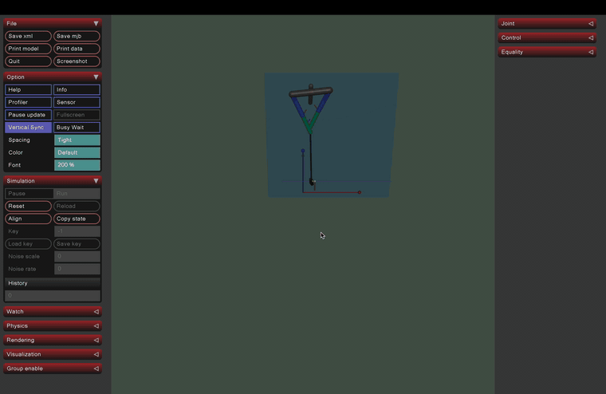
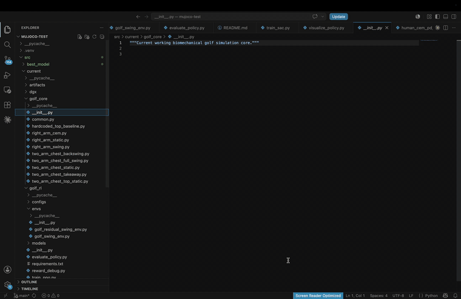

# MuJoCo Golf Swing AI

**A MuJoCo reinforcement-learning environment for optimizing a biomechanical golf swing in simulation.**

## Project Demos

<table>
  <tr>
    <td align="center"><strong>Simulated golf swing</strong></td>
    <td align="center"><strong>Code and model walkthrough</strong></td>
  </tr>
  <tr>
    <td></td>
    <td></td>
  </tr>
</table>

## Overview

This project investigates how reinforcement learning can improve control in a physics-based environment when detailed biomechanical data is difficult to obtain.

MuJoCo is used to model the golfer, club, tee, ball, and joint dynamics, allowing the system to generate experience through simulation rather than relying on a large motion-capture dataset.

Golf provides a compact testbed for several broader AI problems, including reward design, constrained physical optimization, contact dynamics, and learning effective behavior from repeated interaction.

The project began with simple joint actuation and gradually evolved into a two-arm and torso system with **16 controlled degrees of freedom**. The current controller starts from a structured reference swing and learns residual adjustments intended to improve the resulting shot.

All current experiments are simulation-based**.**

## Development Progression

The simulator was built incrementally so that each increase in biomechanical and control complexity could be evaluated before moving to the next stage.

1. **2-joint torque-control prototype**
   Established basic club movement and initial ball contact.

2. **3-joint PD-controlled swing**
   Added more stable trajectory control.

3. **7-DOF biomechanical arm model**
   Introduced more realistic shoulder, elbow, forearm, and wrist motion.

4. **15-DOF two-arm inverse-kinematics system**
   Extended the model to coordinated bilateral movement.

5. **Two-arm + torso reinforcement-learning controller**
   Added learned residual actions on top of the reference motion.

## Research Questions

The project focuses on several questions:

* Can reinforcement learning improve shot outcomes beyond a hand-designed reference swing?
* How should the reward function balance swing structure, stability, direction, trajectory, and distance?
* What behavior emerges when the policy is free to deviate from the reference motion in pursuit of a better result?
* How can model complexity be increased without making training unstable or impractical?

## Results

The current best RL checkpoint was selected after approximately **1.725 million simulation timesteps**.

Relative to the baseline controller, the learned policy:

* reduced post-impact lateral error by **73.2%**
* increased maximum ball height by **84.9%**
* increased evaluation-window carry distance by **26.9%**
* improved target-line factor from **0.004 to 0.783**
* achieved a best evaluation reward of **3277.84** under `post_impact_summary_v3`

Pose-tracking error increased by approximately **3.8%** even as shot direction and trajectory improved substantially. This result suggests that strict imitation of a reference motion can conflict with the behavior that best satisfies the actual reward objective.

## Project Structure

* `src/best_model/` — restored snapshot of the earlier model that produced the best one-arm results.
* `src/current/` — active working version of the simulator.
* `src/current/golf_core/` — biomechanical models, simulation components, and swing controllers.
* `src/current/golf_rl/` — reinforcement-learning training, evaluation, and visualization tools.
* `src/current/legacy/` — older experiments preserved for reference.
* `src/current/artifacts/` — saved training outputs, checkpoints, and model files.
* `src/current/CURRENT.md` — current experiment notes, commands, and implementation status.

## Installation and Setup

### Requirements

The project uses:

* Python
* MuJoCo
* MuJoCo Python tooling
* reinforcement-learning dependencies used by `golf_rl`
* `mjpython` for MuJoCo visualization on macOS

Clone the repository:

```bash
git clone https://github.com/zachhuang6-design/mujoco-golf-ai.git
cd mujoco-golf-ai
```

Create and activate a virtual environment:

```bash
python3 -m venv .venv
source .venv/bin/activate
```

Install dependencies:

```bash
pip install -r requirements.txt
```

If the repository is configured for editable installation:

```bash
pip install -e .
```

For the latest environment notes and implementation details, see:

```text
src/current/CURRENT.md
```

## Reproducing the Current Results

The commands below assume the repository has been cloned, the virtual environment is active, and they are being run from the repository root.

### View the completed kinematics swing

```bash
cd src/current

mjpython two_arm_chest_full_swing.py \
  --club 7iron \
  --hand right \
  --speed 1
```

### View the current best two-arm RL policy

```bash
cd src/current

mjpython -m golf_rl.visualize_two_arm_joint_policy \
  artifacts/trained_models_two_arm_joint/best_model \
  --club 7iron \
  --hand right \
  --speed 6
```

### Continue training from the saved policy

```bash
cd src/current

PYTHONDONTWRITEBYTECODE=1 python -m golf_rl.train_two_arm_joint_sac \
  --club 7iron \
  --hand right \
  --timesteps 100000 \
  --device cpu
```

### View the earlier biomechanical one-arm RL swing

```bash
cd src/best_model

mjpython human_right_arm_biomech_swing.py \
  --club 7iron \
  --hand right
```

## Long-Term Direction

Future work can extend the environment with:

* fuller spine, hip, pelvis, and leg mechanics
* ground interaction
* improved hand, grip, shaft, and club behavior
* richer impact and ball-flight modeling
* additional clubs and swing objectives
* curriculum learning
* domain randomization and robustness testing
* imitation learning from real swing trajectories
* comparisons across reinforcement-learning algorithms and controller architectures
* eventual sim-to-real experiments

The long-term aim is to use this system as a progressively richer testbed for learning and optimization in articulated physical environments.
